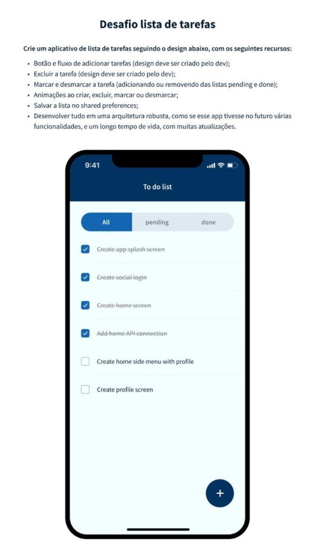

# Eclipse Works Todo List

Este projeto foi desenvolvido utilizando a versão mais recente do Flutter no momento (3.10.1), recomendo o uso do [fvm](https://fvm.app) para que possa executá-lo sem problemas.

## Requisitos

- Botão e fluxo de adicionar tarefas ✅
- Excluir a tarefa ✅
  - basta arrastar o ListTile para a esquerda e confirmar a exclusão
- Marcar e desmarcar refletindo nos filtros `pending` e `done` ✅
- Animações ao criar, excluir, marcar ou desmarcar ❌
  - não consegui implementar
- Salvar a lista no shared_preferences ✅
- Arquitetura robusta considerando funcionalidades futuras, longo tempo de vida e muitas atualizações 🧐
  - Utilizei uma arquitetura de módulos com Provider, facilitando injeção de dependências e consumo de classes de forma global, como o SharedPreferences, por exemplo
  - Criei uma camada de repositories para lidar com dados e uma camada de services para tratamento de regras de negócio entre o repository e a camada de apresentação, caso não tenham regras o service atua como um mero proxy
  - Para gerência de estado utilizei Bloc, especificamente Cubit
    - Preferi utilizar o Provider em vez do BlocProvider por uma questão de semântica, fica estranho a nomenclatura RepositoryProvider para um Service, por exemplo. Também dá a possibilidade de utilizar outras features do Provider como o ChangeNotifierProvider (utilizado na troca de tema)
  - Não pensei em nenhuma estrutura para lidar com migrations, visto que no app o SharedPreferences é utilizado como um banco de dados, para isso o ideal seria uma solução mais robusta como o Sqlite ou o Isar, mantendo o SharedPreferences exclusivamente para chave/valor

## Extras

- Suporte a tema dark
- Alguns testes unitários

## Créditos

A imagem utilizada para o ícone do app foi obtida na [Wikimedia](https://commons.wikimedia.org/wiki/File:Emoji_u1f4dd.svg) e os arquivos dimensionados corretamente no [appicon.co](https://www.appicon.co/).
